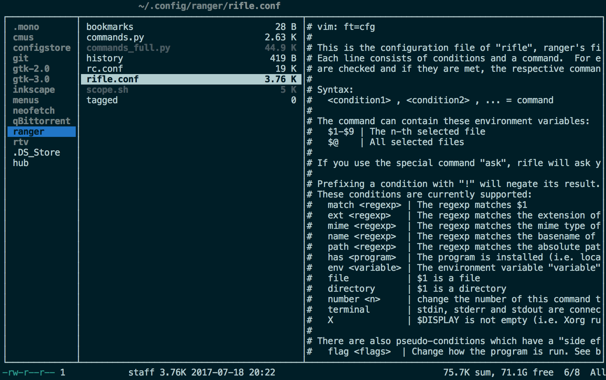

# Intro to the Ranger File Manager and `rifle.conf` for macOS

Ranger is a file manager for the terminal and my default file manager since I moved away from `Midnight Commander` (`mc`). Most of my work I do on a MacBook Pro and I found that opening files that weren't text editor compatible was difficult, pressing <Enter> on the highlighted files merely returned an `open with:` prompt, and nothing I typed seemed to work.



I found out that the config file which controls how Ranger opens files when pressing <Enter> is called `rifle.conf` and is normally found in `~/.config/ranger/rifle.conf`.

The default `rifle.conf` however is dense, complex and doesn't play well with an ordinary mac setup.

So I decided to try and strip down `rifle.conf` and rebuild it for use on macOS. If you want to skip straight to the `rifle.conf` that I use, [follow this link](files/rifle.conf).

Now open up your own `rifle.conf` and start editing:

```shell-script
vim ~/.config/ranger/rifle.conf
```

The pre-amble comments give examples of how to set up the file, but this took me a while to understand. I finally decided to remove everything and start from scratch.

`rifle.conf` is structured so each line provides a set of conditions separated by commas (`,`) e.g. `ext mp3`, followed by an equals `=`, then a terminal command, e.g. vlc `$@`. When Ranger is asked to open a file, it cycles through every line from top to bottom until it finds a line where all the conditions are met, then it runs the terminal command. This means that the top-most line where all the conditions are met will be run. Using this logic you can construct a `rifle.conf` that works on different systems, if you order potential applications from most to least preferred.

<hl>

## Using `open`

Most Linux applications can simply be opened by typing their name into the terminal, optionally followed by a file to open and various rules, e.g. `zathura example.pdf`. In macOS however, typing the equivalent `preview example.pdf` just returns an error that `preview` has not been found. The same goes for `Preview`, `preview.app` and `Preview.app`.

Instead, on a Mac, I find the best way to call an application from the command line is to use [`open`](https://developer.apple.com/legacy/library/documentation/Darwin/Reference/ManPages/man1/open.1.html).

The following lines all open Preview.app:

```shell-script
open -a preview
open -a preview.app
open -a Preview
open -a Preview.app
```

And to open `example.pdf` just add the file name:

```shell-script
open -a preview example.pdf
```

This same syntax can be applied to `rifle.conf` to open specific apps for specific file types with Ranger.

The simplest condition to use is the file extension (`ext`):

```shell-script
ext pdf = open -a preview "$@"
```

Where `"$@"` is the file path of the file highlighted in Ranger The above there says, if the file extension is `.pdf`, open the file with Preview.app.

<hl>

## Regex

Regular expressions can be used to make more complex conditions, e.g. using `|` to include multiple file extensions in one line, or `[]` and `?` to list similar extensions without repetition. Try to work out what the conditions below mean. If you need a refresher on Regex, I often refer to [this website](LINK TO REGEX):

```shell-script
ext jpe?g|png|gif = open -a preview "$@"
ext od[dfgpst] = open -a libreoffice "$@"
```

<hl>

## MIME types

MIME types are a good last resort for catching any files with unusual extensions, I normally put them at the bottom of a list of preferred applications, to open with a program I know will be installed, for example:

```shell-script
ext xml|json|py|pl|rb|js|sh|php|m[ark]d[own]|txt = vim "$@" 
ext tex = open -a texworks "$@"
mime ^text = nano "$@"
```

<hl> 

## The `has` condition

For the majority of GUI applications on a Mac, the `has` condition does not work, for the same reason that calling applications directly from the terminal by typing their name doesn't work, because Ranger can't find them. As far as I know, there isn't any way to get around this. Maybe if you could check for the presence of the named directory in `~/Applications`, but I haven't worked that out yet.

<hl>

## Taking advantage of LaunchServices defaults

Finally, a good line to keep at the end of `rifle.conf` is:

```shell-script
flag f = open "$@"
```

This takes advantage of `open` using macOS `LaunchServices` to decide the default application when the user doesn't specify one using `-a`. This should catch everything that you haven't listed specifically. I suppose you could just have a `rifle.conf` with only this line and everything would still work as if you were using a GUI, files would be opened with the default Mac GUI application as if you had double clicked on it in `Finder`.

<hl> 

## Formatting

To increase readability I try to split my `rifle.conf` into sections, so I don't get mixed up with my program heirarchies, for example:

```shell-script
#-------------------------------------------
# Web material
#-------------------------------------------
ext x?html?, X, flag f = open -a Safari "$@"
ext x?html?, has w3m, terminal = w3m "$@"

#-------------------------------------------
# Text files
#-------------------------------------------
ext xml|json|tex|py|pl|rb|js|sh|php|m[ark]d[own]|txt = vim "$@"
mime ^text = vim "$@"

#--------------------------------------------
# Audio without X
#-------------------------------------------
ext mp3 = /Applications/VLC.app/Contents/MacOS/VLC --intf ncurses  "$@"
```

Now build your own `rifle.conf` using the tips above!

<hl>

# A final tip

If you find yourself switching between Finder and Ranger a lot, especially as you transition to the terminal, adding this keybinding to `~/.config/ranger/rc.conf` will allow you to open Finder on the highlighted file with `%`:

```shell-script
map % shell open -R %s
```

It opens the shell prompt and uses `open` to call Finder (`-R`) on the highlighted file (`%s`). You could do similar if you wanted to quickly specify a non-default editor for a file:

```shell-script
map te shell open -a textedit %s
```


